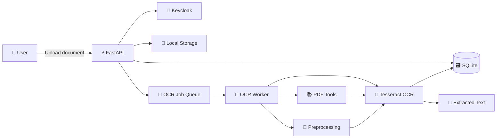
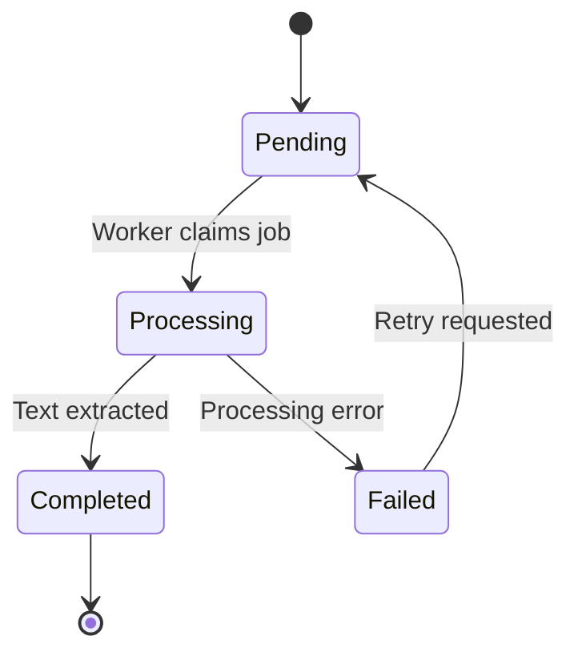

# 🐣 Halando OCR API

<div align="center">

### 📄 Drop a document. 🔍 Extract the text. 🧠 Learn how real backend systems work.

A local-first OCR and document-processing API built with **Python**, **FastAPI**, **Tesseract OCR**, **SQLite**, **Keycloak**, and **Docker**.


</div>

---

## 🌈 What Is This Project?

**Halando OCR API** is a fully local document-processing backend that accepts files, extracts their text, stores processing information, and provides secured API endpoints for accessing the results.

The project is designed to demonstrate more than just calling an OCR command.

It explores how a real backend system can:

* 📥 Receive and validate uploaded files
* 🧹 Prepare documents before OCR
* 👀 Extract text from images and scanned PDFs
* 🇬🇧 Recognize English text
* 🇻🇳 Recognize Vietnamese text
* 🧵 Process expensive jobs through a worker
* 🔐 Protect endpoints using Keycloak
* 🗃️ Store job and document metadata
* 🐳 Package system dependencies with Docker
* 🧪 Document and test APIs using Bruno
* 🚨 Handle failures without crashing the entire application

---

## 🎪 Why Does This Project Exist?

Many tutorials stop here:

```python
text = pytesseract.image_to_string(image)
```

That is useful, but it does not represent a complete application.

This project focuses on the surrounding engineering work:

```text
Upload
   ↓
Validate
   ↓
Store document
   ↓
Create OCR job
   ↓
Process document
   ↓
Save extracted text
   ↓
Return job result
```

The goal is to build a project that demonstrates practical backend knowledge instead of presenting OCR as one magical function.

---

## 🧠 Skills Demonstrated

| Area                | Skills                                                              |
| ------------------- | ------------------------------------------------------------------- |
| 🐍 Python           | Type hints, modules, dependency management, exception handling      |
| ⚡ FastAPI           | Routers, dependencies, validation, middleware, async endpoints      |
| 📄 OCR              | Tesseract, language packs, scanned documents, image preprocessing   |
| 📚 PDF Processing   | Poppler, Ghostscript, QPDF and PDF page conversion                  |
| 🧼 Document Cleanup | Unpaper, image cleanup and OCR preparation                          |
| 🔐 Authentication   | Keycloak, OAuth 2.0, OpenID Connect and JWT validation              |
| 🗃️ Persistence     | SQLite, entities, repositories and migrations                       |
| 🧵 Background Work  | OCR worker design and long-running job processing                   |
| 🐳 Docker           | Linux packages, reproducible environments and container isolation   |
| 🧪 API Testing      | Bruno collections, environment variables and authenticated requests |
| 🏗️ Architecture    | Layer separation, configuration management and service boundaries   |
| 🛡️ Reliability     | File limits, validation, logging and recoverable failures           |

---

## 🏰 System Architecture



---

## 🧩 Main Components

### ⚡ FastAPI Application

The API layer is responsible for:

* Receiving upload requests
* Validating file type and size
* Authenticating users
* Creating document records
* Creating OCR jobs
* Returning job statuses and results
* Converting internal errors into clear HTTP responses

### 🐝 OCR Worker

The worker handles expensive processing outside the normal request flow.

Its responsibilities include:

* Finding pending OCR jobs
* Loading stored documents
* Preparing PDF pages or images
* Running Tesseract OCR
* Combining text from multiple pages
* Updating job status
* Recording processing failures

The worker can be started with:

```bash
python -m app.workers.ocr_worker
```

### 👀 Tesseract OCR

Tesseract performs the actual character recognition.

Configured languages:

```text
eng — English
vie — Vietnamese
```

Example usage:

```bash
tesseract input.png stdout -l eng+vie
```

### 📚 PDF Toolchain

The Docker image includes several utilities because PDFs can be unpredictable little monsters. 👹

| Tool            | Purpose                                     |
| --------------- | ------------------------------------------- |
| `poppler-utils` | Convert PDF pages and inspect PDF files     |
| `ghostscript`   | Render and normalize PDF content            |
| `qpdf`          | Validate, inspect and repair PDF structures |
| `unpaper`       | Clean scanned pages before OCR              |
| `tesseract-ocr` | Recognize text from page images             |

### 🔐 Keycloak

Keycloak provides authentication and authorization without requiring the project to manually build:

* Password storage
* Login sessions
* Access tokens
* Refresh tokens
* User management
* Role management
* OAuth 2.0 flows
* OpenID Connect flows

The API validates Keycloak-issued JWT access tokens before allowing protected operations.

For local development, Docker Compose starts a `keycloak` service on `http://localhost:8080` and imports `infra/keycloak/halando-realm.json`. The realm includes a public OIDC client named `halando-api`, application roles, and a seeded user:

```text
username: demo
password: demo123!
```

The application also seeds the same fixed user subject into SQLite so `/api/v1/me` can sync the authenticated Keycloak user into `app_users`.

Inside Docker, the API reaches Keycloak at `http://keycloak:8080`; the browser reaches it at `http://localhost:8080`. If you run the API directly on your host, set `KEYCLOAK_SERVER_URL=http://localhost:8080`.

### 🗃️ SQLite

SQLite keeps the project lightweight and easy to run locally.

It can store information such as:

* Users or external user identifiers
* Uploaded documents
* Original filenames
* Storage locations
* MIME types
* OCR job statuses
* Extracted text
* Error messages
* Creation and completion timestamps

---

## 🗂️ Suggested Project Structure

```text
halando-ocr-api/
│
├── app/
│   ├── api/
│   │   ├── dependencies/
│   │   ├── routes/
│   │   └── schemas/
│   │
│   ├── core/
│   │   ├── config.py
│   │   ├── logging.py
│   │   └── security.py
│   │
│   ├── db/
│   │   ├── models/
│   │   ├── repositories/
│   │   └── session.py
│   │
│   ├── services/
│   │   ├── document_service.py
│   │   ├── ocr_service.py
│   │   └── storage_service.py
│   │
│   ├── workers/
│   │   └── ocr_worker.py
│   │
│   ├── main.py
│   └── __init__.py
│
├── bruno/
│   ├── auth/
│   ├── documents/
│   └── jobs/
│
├── data/
│   ├── uploads/
│   ├── processed/
│   └── app.db
│
├── tests/
├── .env.example
├── Dockerfile
├── docker-compose.yml
├── pyproject.toml
└── README.md
```

---

## 🚦 OCR Job Lifecycle



Possible job statuses:

| Status          | Meaning                                |
| --------------- | -------------------------------------- |
| 🟡 `PENDING`    | Waiting for a worker                   |
| 🔵 `PROCESSING` | OCR is currently running               |
| 🟢 `COMPLETED`  | Text extraction succeeded              |
| 🔴 `FAILED`     | Processing stopped because of an error |

---

## 🐳 Docker Environment

The OCR worker runs inside a Debian-based Python container.

```dockerfile
FROM python:3.14-slim
```

The container installs all required native OCR and PDF tools:

```dockerfile
RUN apt-get update && apt-get install -y --no-install-recommends \
    tesseract-ocr \
    tesseract-ocr-eng \
    tesseract-ocr-vie \
    ghostscript \
    qpdf \
    poppler-utils \
    unpaper \
    && rm -rf /var/lib/apt/lists/*
```

This prevents the classic developer tragedy:

> “It works on my machine.” 🥲

Instead, the project aims for:

> “It works inside the same container everywhere.” 🐳

---

## 🛠️ Local Setup

### 1. Clone the Repository

```bash
git clone https://github.com/your-username/halando-ocr-api.git
cd halando-ocr-api
```

### 2. Create the Environment File

```bash
cp .env.example .env
```

Example configuration:

```env
APP_NAME=doc-ocr-api
APP_ENV=local
SECRET_KEY=change-me-now
AUTH_PROVIDER=keycloak

DATABASE_URL=sqlite+aiosqlite:////app/data/dococr.db
LOCAL_STORAGE_ROOT=/app/data/storage

KEYCLOAK_SERVER_URL=http://keycloak:8080
KEYCLOAK_PUBLIC_SERVER_URL=http://localhost:8080
KEYCLOAK_REALM=halando
KEYCLOAK_CLIENT_ID=halando-api
KEYCLOAK_AUDIENCE=halando-api

SEEDED_ACCOUNT_USERNAME=demo
SEEDED_ACCOUNT_PASSWORD=demo123!
SEEDED_ACCOUNT_EMAIL=demo@halando.local

MAX_UPLOAD_SIZE_MB=25
OCR_DEFAULT_LANGUAGE=eng
OCR_TIMEOUT_SECONDS=300
```

Do not commit the real `.env` file.

### 3. Build the Containers

```bash
docker compose build
```

### 4. Start the Services

```bash
docker compose up
```

### 5. Open the API Documentation

```text
http://localhost:8000/docs
```

Open the local browser UI and sign in with the seeded Keycloak account:

```text
http://localhost:8000/ui
username: demo
password: demo123!
```

---

## 🧪 Testing with Bruno

This project uses Bruno instead of requiring a frontend application.

The Bruno collection can demonstrate the complete API flow:

```text
1. Request a Keycloak access token
2. Upload a PDF or image
3. Receive the document and OCR job IDs
4. Check the OCR job status
5. Retrieve the extracted text
6. Test validation and authorization failures
```

Example authenticated request:

```http
GET /api/v1/ocr-jobs/{job_id}
Authorization: Bearer <access-token>
```

This proves that the backend can be used independently by:

* Web applications
* Mobile applications
* Internal tools
* Automation scripts
* Other backend services

---

## 📡 Example API Endpoints

| Method   | Endpoint                       | Description              |
| -------- | ------------------------------ | ------------------------ |
| `GET`    | `/health`                      | Check application health |
| `POST`   | `/api/v1/documents`            | Upload a document        |
| `GET`    | `/api/v1/documents/{id}`       | Get document metadata    |
| `POST`   | `/api/v1/documents/{id}/ocr`   | Create an OCR job        |
| `GET`    | `/api/v1/ocr-jobs/{id}`        | Get OCR job status       |
| `GET`    | `/api/v1/ocr-jobs/{id}/result` | Retrieve extracted text  |
| `POST`   | `/api/v1/ocr-jobs/{id}/retry`  | Retry a failed job       |
| `DELETE` | `/api/v1/documents/{id}`       | Delete a document        |

---

## 📦 Example Upload

```bash
curl -X POST "http://localhost:8000/api/v1/documents" \
  -H "Authorization: Bearer YOUR_ACCESS_TOKEN" \
  -H "Content-Type: multipart/form-data" \
  -F "file=@sample.pdf"
```

Example response:

```json
{
  "document_id": "ec9f490c-f6de-43fb-a2ba-8089dc6c985a",
  "filename": "sample.pdf",
  "content_type": "application/pdf",
  "status": "uploaded"
}
```

---

## 📝 Example OCR Result

```json
{
  "job_id": "ef18e825-f21c-43e1-a97e-f8130187656e",
  "document_id": "ec9f490c-f6de-43fb-a2ba-8089dc6c985a",
  "status": "completed",
  "language": "eng+vie",
  "page_count": 3,
  "text": "Extracted document content appears here.",
  "created_at": "2026-07-11T08:30:00Z",
  "completed_at": "2026-07-11T08:30:14Z"
}
```

---

## 🛡️ Validation and Safety

The API should not trust uploaded files just because they have a friendly filename.

Recommended checks include:

* File size limit
* Allowed MIME types
* Allowed file extensions
* Generated storage filenames
* PDF validation
* Maximum PDF page count
* OCR timeout
* Prevention of path traversal
* Rejection of empty files
* Cleanup of temporary files
* Restricted container permissions
* Clear processing error messages

Example failure response:

```json
{
  "detail": {
    "code": "UNSUPPORTED_FILE_TYPE",
    "message": "Only PDF, PNG and JPEG files are supported."
  }
}
```

---

## 📖 What I Learned

### 1. OCR Is More Than Reading an Image

Good OCR depends on the entire pipeline:

```text
Input quality
   + document validation
   + page rendering
   + image preprocessing
   + language configuration
   + error handling
   = useful OCR output
```

### 2. Native Dependencies Matter

Python packages alone are not always enough.

OCR and PDF processing require system-level software such as Tesseract, Poppler, Ghostscript and QPDF. Docker makes these dependencies reproducible.

### 3. Expensive Tasks Should Not Block Requests

OCR may take several seconds or minutes.

Separating OCR into a worker allows the API to respond quickly while processing continues independently.

### 4. Authentication Should Use Established Standards

Keycloak provides a practical way to learn:

* JWT structure
* Token signatures
* Issuers and audiences
* OAuth 2.0
* OpenID Connect
* Roles and permissions

### 5. Local Projects Can Still Demonstrate Production Thinking

A project does not need to run on an expensive cloud platform to demonstrate:

* Clean architecture
* Containerization
* Authentication
* Database design
* Background processing
* API documentation
* Automated testing
* Error handling
* Security awareness

---

## 🎓 Knowledge Showcase

This project demonstrates an understanding of several backend concepts working together:

```text
                        🌟 HALANDO OCR API 🌟
                                  |
           +----------------------+----------------------+
           |                      |                      |
        Backend                Platform               Documents
           |                      |                      |
       FastAPI                 Docker                Tesseract
       Pydantic                Linux                 Poppler
       Services                Env config            Ghostscript
       Repositories            Logging               QPDF
           |                      |                      |
           +----------------------+----------------------+
                                  |
                              🔐 Security
                                  |
                           Keycloak + JWT
                                  |
                              🗃️ Data
                                  |
                               SQLite
```

---

## 🗺️ Future Improvements

* 🚀 Add PostgreSQL support
* 📨 Add Redis-backed job queues
* 🐇 Add Celery, Dramatiq or RQ
* 📊 Add OCR confidence reporting
* 🧠 Add document classification
* 🗣️ Add more OCR languages
* 🔎 Add full-text document search
* 📑 Export extracted content as JSON or TXT
* 🧪 Add integration and performance tests
* 📈 Add Prometheus-compatible metrics
* 🧾 Add structured audit logs
* ☁️ Add optional cloud object storage
* 🖥️ Add a lightweight document dashboard

---

## 🧪 Development Commands

Start the API with hot reload:

```bash
uvicorn app.main:app --host 0.0.0.0 --port 8000 --reload
```

Start the OCR worker:

```bash
python -m app.workers.ocr_worker
```

Run tests:

```bash
pytest
```

Run formatting:

```bash
ruff format .
```

Run linting:

```bash
ruff check .
```

Run type checking:

```bash
mypy app
```

---

## 🐞 Known Challenges

OCR accuracy may vary depending on:

* Low-resolution scans
* Rotated pages
* Handwritten content
* Complex tables
* Decorative fonts
* Multiple columns
* Shadows or damaged paper
* Unsupported languages
* Password-protected PDFs

The project treats OCR output as extracted text, not guaranteed perfect transcription.

---

## 🤹 Tiny Developer Survival Guide

```text
API not starting?
    └── Check environment variables.

OCR returning nonsense?
    └── Check image quality and language configuration.

PDF refusing to cooperate?
    └── Validate it with QPDF.

Worker doing nothing?
    └── Check pending jobs and application logs.

Keycloak says 401?
    └── Check issuer, audience, realm and token expiration.

Everything is on fire?
    └── docker compose down
        docker compose build --no-cache
        docker compose up
```

---

## 📌 Project Status

```text
🟢 API foundation
🟢 Local file storage
🟢 SQLite integration
🟢 Docker OCR environment
🟢 English and Vietnamese OCR
🟢 Keycloak integration
🟡 Background worker flow
🟡 Bruno API collection
⚪ Automated test coverage
⚪ Advanced preprocessing
⚪ Production deployment
```

Legend:

```text
🟢 Completed
🟡 In progress
⚪ Planned
```

---

## 👨‍💻 Author

Built by a software engineer from Vietnam as a practical exploration of:

```text
Python backend development
+ document processing
+ authentication
+ containerization
+ system design
```

This repository is not only an OCR experiment.

It is a demonstration of how multiple tools, services and engineering decisions can be combined into one maintainable backend application.

---

<div align="center">

## 🌟 Documents Go In — Knowledge Comes Out 🌟

```text
📄 ➜ 🐳 ➜ 🐝 ➜ 👀 ➜ 🧠 ➜ 📝
```

Give the repository a star if the tiny OCR worker successfully reads your document without becoming emotionally attached to the PDF. ⭐

</div>
