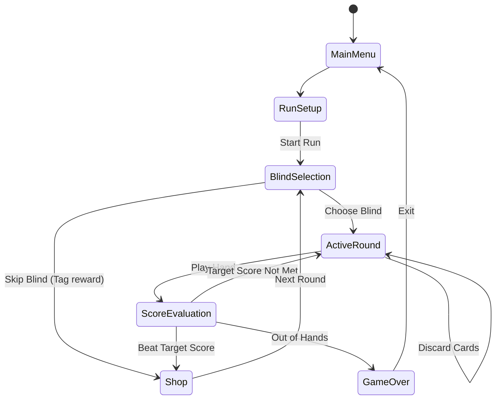

# Balatro Replication: Core Game Logic

This document details the mathematical framework, game state loops, scoring equations, and the event-driven architecture required to handle Balatro's deep combo systems.

---

## 1. Core State Loop & State Machine
The game operates under a finite state machine. Transitions are driven by player actions or state check conditions.



---

## 2. Core Scoring Formula
Every played hand evaluates to:

$$\text{Final Score} = \text{Chips} \times \text{Multiplier (Mult)}$$

The score is calculated via an ordered execution pipeline:
1. **Base Hand Value**: Set by the evaluated poker hand type (e.g., Two Pair = 20 Chips $\times$ 2 Mult).
2. **Hand Levels**: Planet cards increase these base values (e.g., leveling up Two Pair adds +20 Chips and +2 Mult permanently).
3. **Scored Cards (Base + Enhancements)**: Cards in the hand are evaluated left-to-right.
   - Standard Rank value (Aces = 11, Face = 10, others = face value).
   - Enhancements (e.g., Bonus Card adds +30 Chips; Mult Card adds +4 Mult).
4. **Scored Cards (Editions)**: 
   - Foil adds +50 Chips.
   - Holographic adds +10 Mult.
   - Polychrome multiplies total Mult by $1.5\times$.
5. **Held-in-Hand Triggers**: Cards in hand (not played) trigger their effects (e.g., Steel cards multiply total Mult by $1.5\times$).
6. **Jokers (Left-to-Right)**: Each active Joker is evaluated in its slot order. Modifiers can add/subtract/multiply Chips or Mult.

---

## 3. The Joker & Card Event System (Observer Pattern)
To handle complex and cascading Joker logic, the engine implements an event-driven observer system. Cards, Jokers, and deck modifications register hooks onto the `GameEngine`.

### Key Events
- `on_draw_hand(cards)`: Triggered when new cards are dealt into the hand.
- `on_evaluate_hand(played_hand, hand_type)`: Dispatched before scoring checks, allowing cards/jokers to modify hand types (e.g., "Four Fingers" allows Flushes/Straights with 4 cards).
- `on_score_card(card, is_played)`: Triggers when an individual card is evaluated for chips, mult, or special effects.
- `on_score_hand(base_chips, base_mult)`: Triggers during Joker scoring. Passes mutable scoring variables (`ScoreContext`) through the active Jokers from left to right.
- `on_discard(discarded_cards)`: Triggered when the player discards.
- `on_round_end(victory)`: Triggers on winning or losing a round.
- `on_buy_item(item)`: Triggers when buying from the shop.

### Example Code Concept: Joker Base Class
```python
class ScoreContext:
    def __init__(self, chips: int, mult: float):
        self.chips = chips
        self.mult = mult

class Joker:
    def __init__(self, name: str, value: int, description: str):
        self.name = name
        self.value = value
        self.description = description

    def on_score_hand(self, context: ScoreContext, played_cards: list, hand_type: str) -> None:
        """Modify context chips or mult during evaluation."""
        pass

    def on_discard(self, discarded_cards: list) -> None:
        """Execute side-effects when cards are discarded."""
        pass

# Example Custom Joker
class FibonnaciJoker(Joker):
    def on_score_hand(self, context: ScoreContext, played_cards: list, hand_type: str) -> None:
        # Aces, 2s, 3s, 5s, and 8s give +8 Mult when scored
        for card in played_cards:
            if card.rank in [1, 2, 3, 5, 8]:
                context.mult += 8
                # Dispatch trigger visual event
                emit_visual_trigger(self)
```

---

## 4. Cards & Modifiers
Individual playing cards are composed of a structural hierarchy of properties:

```
Card
├── Rank (2-A)
├── Suit (Hearts, Clubs, Diamonds, Spades)
├── Suit Override (e.g. Wild Card)
├── Enhancement (None, Bonus, Mult, Wild, Glass, Steel, Gold, Stone)
├── Edition (None, Foil, Holographic, Polychrome)
└── Seal (None, Red (Retrigger), Blue (Planet), Gold (Money), Purple (Tarot))
```

### Modifier Interaction Rules
- **Enhancements** change how a card behaves when evaluated or held. Only one Enhancement can be present per card.
- **Editions** apply a visual overlay and a global flat or multiplicative boost to the score/chips.
- **Seals** add utility effects (e.g. Red Seal retriggers all effects on the card, meaning it gets evaluated twice).
