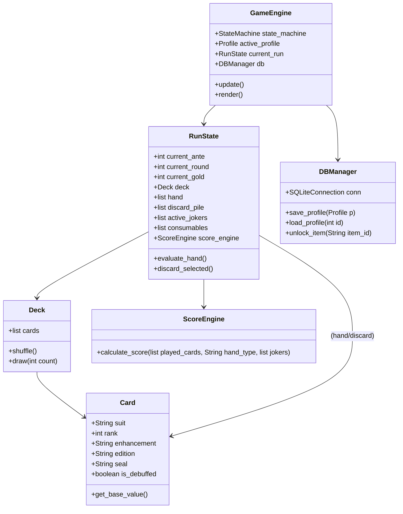

# Balatro Replication: Planning & Architecture

This document maps out the system architecture, database structure, and a step-by-step development schedule to guide the build process.

---

## 1. OOP Architecture & Data Relationships

The project follows a decoupling of model data and visual rendering logic, ensuring we can test core gameplay without launching a window.



---

## 2. Database Schema (SQLite)

We will use SQLite for managing local game profiles, unlocked items, and statistics.

```sql
-- Profiles table to store user settings and save states
CREATE TABLE IF NOT EXISTS profiles (
    id INTEGER PRIMARY KEY AUTOINCREMENT,
    name TEXT NOT NULL,
    created_at TIMESTAMP DEFAULT CURRENT_TIMESTAMP,
    high_score INTEGER DEFAULT 0,
    total_runs INTEGER DEFAULT 0,
    total_wins INTEGER DEFAULT 0,
    active_run_json TEXT -- Stores serialized RunState to resume runs
);

-- Card unlocks tracking (Collection)
CREATE TABLE IF NOT EXISTS unlocks (
    profile_id INTEGER,
    item_id TEXT NOT NULL,
    unlocked_at TIMESTAMP DEFAULT CURRENT_TIMESTAMP,
    PRIMARY KEY (profile_id, item_id),
    FOREIGN KEY (profile_id) REFERENCES profiles(id)
);

-- Detailed stats for each completed run
CREATE TABLE IF NOT EXISTS run_history (
    id INTEGER PRIMARY KEY AUTOINCREMENT,
    profile_id INTEGER,
    score INTEGER NOT NULL,
    ante_reached INTEGER NOT NULL,
    win BOOLEAN NOT NULL,
    duration_seconds INTEGER,
    played_at TIMESTAMP DEFAULT CURRENT_TIMESTAMP,
    FOREIGN KEY (profile_id) REFERENCES profiles(id)
);
```

---

## 3. Phased Implementation Schedule

### Phase 1: Core Engine & Testing (Weeks 1 - 2)
*   **Goal**: Establish a CLI-based or unit-test-validated version of the gameplay math.
*   **Deliverables**:
    *   `Card`, `Deck`, and `Hand` structures.
    *   Poker hand evaluator (evaluating Flush, Full House, Straight, etc., up to 5 cards).
    *   Scoring calculation math (`Chips * Mult` engine).
    *   Unit tests for scoring triggers and edge cases.

### Phase 2: Graphic Engine & Window Setup (Week 3)
*   **Goal**: Render a window with Arcade/Pygame, implement screen switching, and display a basic mock deck.
*   **Deliverables**:
    *   Window setup with aspect ratio locking.
    *   State machine integrating Main Menu, Blind Selection, Play Area, and Game Over.
    *   Basic event handler mapping mouse click coordinates to UI triggers.

### Phase 3: Card Interactions & Physics (Week 4)
*   **Goal**: Render cards and make them feel good to interact with.
*   **Deliverables**:
    *   Card rendering class with hover scaling, shadow displacements, and slide-in animations.
    *   Drag-and-drop selecting of cards (up to 5 in hand).
    *   Card dealing arc animations and discard card animations.

### Phase 4: Scoring Sequence & Visuals (Week 5)
*   **Goal**: Build the scoring overlay and hook it up to the graphics loop.
*   **Deliverables**:
    *   Triggering scoring overlay that locks inputs.
    *   Card-by-card score calculation animation sequence.
    *   Visual "triggers" (particles, screenshake) when card effects fire.

### Phase 5: Shop, Booster Packs & Progression (Weeks 6 - 7)
*   **Goal**: Build the shop interface and run customization.
*   **Deliverables**:
    *   Shop UI screen offering Jokers, Tarot/Planet cards, and Vouchers.
    *   Booster pack draft interface.
    *   SQLite Database setup for profile creation, saving/loading, and tracking unlocks.
    *   Collection view screen in the Main Menu querying SQLite database.

### Phase 6: Expansion & Polishing (Week 8)
*   **Goal**: Adding variety to gameplay and fine-tuning aesthetics.
*   **Deliverables**:
    *   Implement 20+ distinct Jokers, 5+ Card Enhancements/Editions.
    *   CRT/psychedelic screen shaders.
    *   Compile python files into a distributable desktop bundle using PyInstaller.
