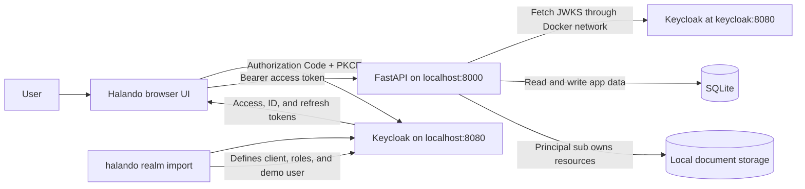
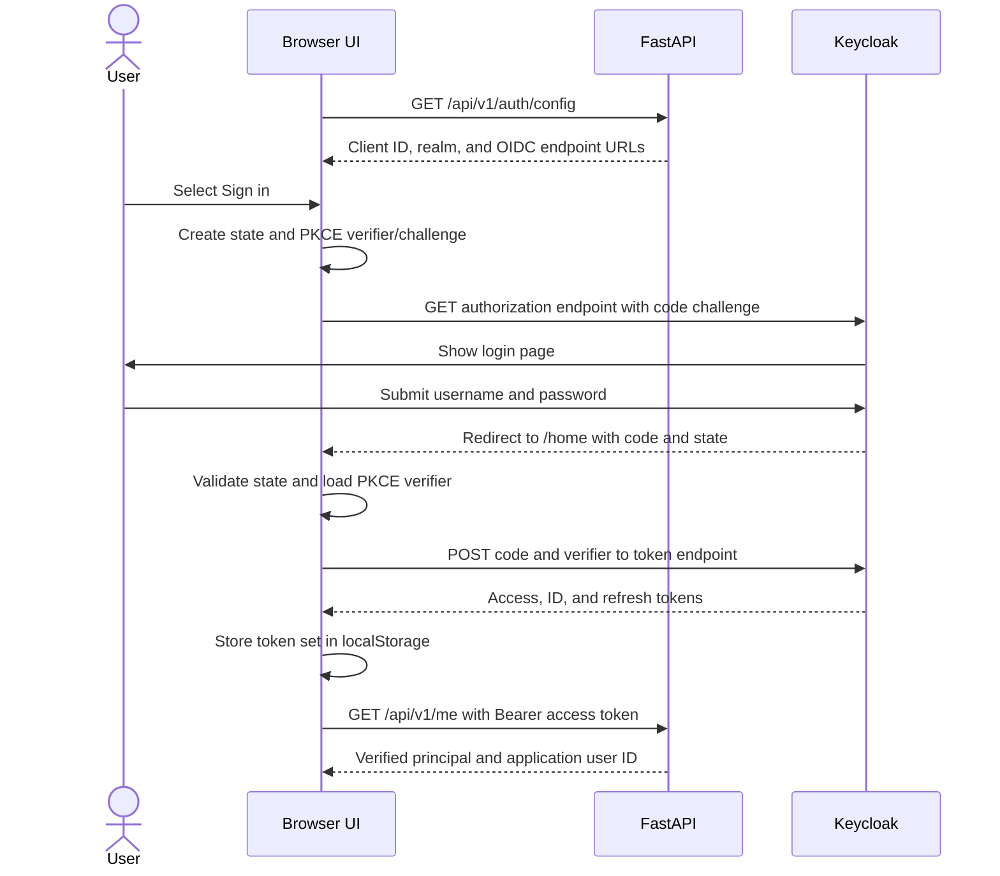
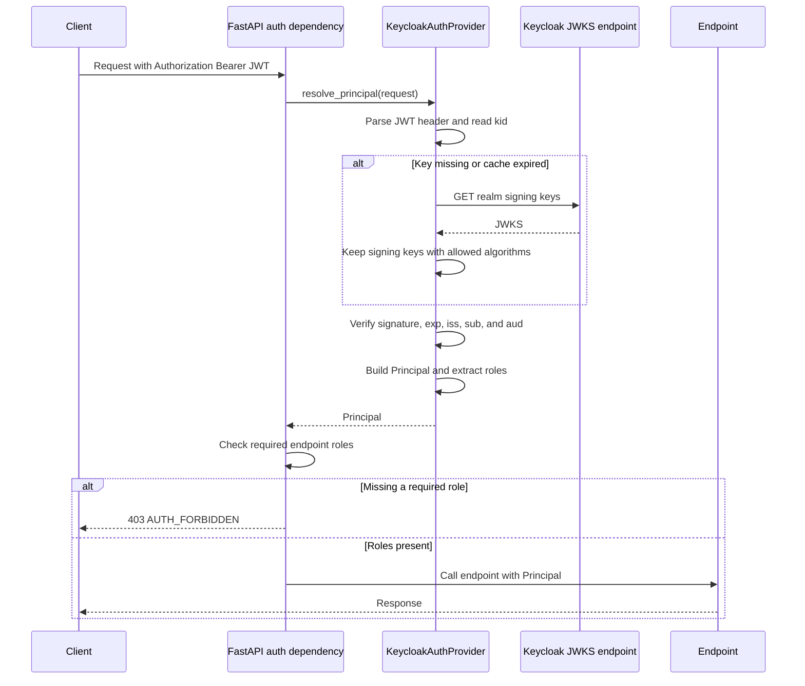
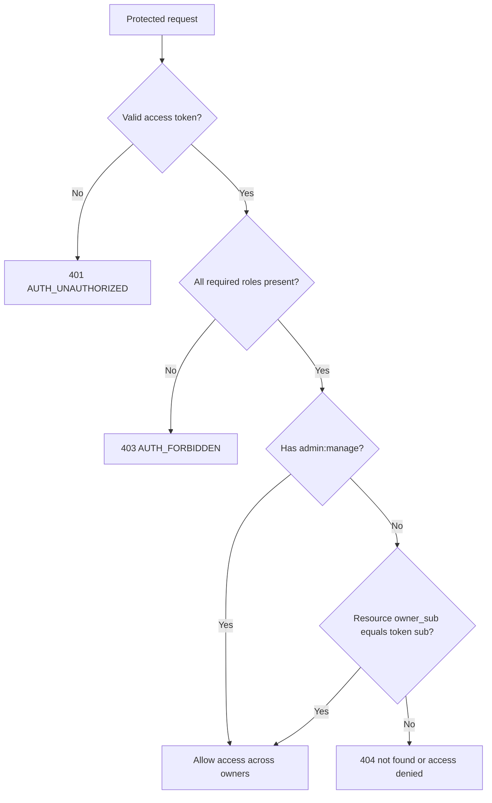

# Keycloak Guidance for Halando

This guide explains how Keycloak authentication and authorization work in this project. It is based on the current code and local Docker configuration rather than on a generic Keycloak setup.

## 1. Mental model

Keycloak and the Halando API have separate responsibilities:

| Responsibility | Owner |
| --- | --- |
| Login page, password validation, and login session | Keycloak |
| Issuing access, ID, and refresh tokens | Keycloak |
| Defining users, clients, and application roles | Keycloak realm configuration |
| Storing tokens and refreshing them in the browser | Halando browser UI |
| Verifying access-token signature and claims | Halando API |
| Enforcing endpoint roles and document ownership | Halando API |
| Keeping application-specific user and document records | SQLite |

The API does not receive or validate the user's password. It trusts a Keycloak access token only after checking its cryptographic signature and required claims.

Key terms used in this project:

- **Realm:** `halando`, the Keycloak security boundary containing this project's user, client, and roles.
- **OIDC client:** `halando-api`, a public client shared by the browser UI and API audience.
- **Subject (`sub`):** Keycloak's stable user ID. Halando uses it for user synchronization and resource ownership.
- **Access token:** JWT sent to the API as `Authorization: Bearer <token>`.
- **ID token:** Identity information used during the browser session and as a logout hint. It is not sent to protected API endpoints.
- **Refresh token:** Used by the browser to obtain another access token without asking for the password again.
- **JWKS:** Keycloak's public signing keys. The API downloads and caches these keys to verify JWT signatures.
- **Role:** Permission such as `documents:read` or `admin:manage` included in token claims.

## 2. Architecture



There are deliberately two Keycloak base URLs in local Docker:

- `KEYCLOAK_PUBLIC_SERVER_URL=http://localhost:8080` is reachable by the browser. It also becomes the expected token issuer.
- `KEYCLOAK_SERVER_URL=http://keycloak:8080` is reachable by the API container and is used to fetch JWKS.

The token can therefore say `iss: http://localhost:8080/realms/halando`, while the API fetches its public key from `http://keycloak:8080/realms/halando/protocol/openid-connect/certs`.

## 3. Local Keycloak setup

[`docker-compose.yml`](docker-compose.yml) starts Keycloak in development mode and mounts [`infra/keycloak/halando-realm.json`](infra/keycloak/halando-realm.json) into its import directory. `--import-realm` loads that realm when Keycloak starts.

Local addresses:

| Service | URL | Credentials |
| --- | --- | --- |
| Keycloak | `http://localhost:8080` | Admin: `admin` / `admin` |
| Keycloak Admin Console | `http://localhost:8080/admin` | Admin: `admin` / `admin` |
| Halando UI | `http://localhost:8000/home` | App user: `demo` / `demo123!` |
| Halando API docs | `http://localhost:8000/docs` | Bearer token required for protected calls |

The imported realm contains:

- Realm name `halando`.
- Public OIDC client `halando-api`; it has no client secret because browser code cannot safely keep one.
- Authorization Code flow enabled with PKCE method `S256`.
- Direct Access Grants enabled for local command-line token requests.
- Implicit flow and service accounts disabled.
- Redirect URIs and web origins for `localhost:8000` and `127.0.0.1:8000`.
- An audience mapper that adds `halando-api` to access-token `aud`.
- Seeded user `demo` with all six application roles.

The Keycloak user's fixed ID is `00000000-0000-4000-8000-000000000001`. The same subject is configured in [`.env.example`](.env.example), allowing startup seeding and `/api/v1/me` to refer to the same SQLite `app_users` record.

## 4. Browser login flow

The UI implements OIDC directly in [`app/ui/scripts/app.js`](app/ui/scripts/app.js); it does not use the Keycloak JavaScript adapter.



Important implementation details:

1. The UI first calls public endpoint `GET /api/v1/auth/config`. [`app/api/v1/endpoints/auth.py`](app/api/v1/endpoints/auth.py) exposes only the browser-safe OIDC configuration.
2. `beginAuthorization()` creates random OAuth `state` and a PKCE verifier. Only the SHA-256 challenge is sent to Keycloak.
3. `handleAuthCallback()` rejects a callback whose `state` does not match and exchanges the code using the original verifier.
4. Tokens are stored under `dococr.keycloak.tokens` in browser `localStorage`; transient state and the PKCE verifier use `sessionStorage`.
5. `ensureAccessToken()` refreshes the access token when fewer than 30 seconds remain.
6. `authHeaders()` sends only the access token to the API.
7. On a fresh page without locally stored tokens, `syncKeycloakSession()` tries `prompt=none` once. An existing Keycloak session can sign the UI in without showing the login form.
8. Logout clears local tokens, then redirects to Keycloak's logout endpoint with an ID-token hint when available.

## 5. API token validation

At application startup, [`app/core/runtime.py`](app/core/runtime.py) asks [`app/core/auth/factory.py`](app/core/auth/factory.py) to build the provider selected by `AUTH_PROVIDER`. With `AUTH_PROVIDER=keycloak`, one `KeycloakAuthProvider` and one reusable HTTP client live for the application's lifetime.



[`app/core/auth/keycloak.py`](app/core/auth/keycloak.py) performs these checks:

- Requires a syntactically valid `Bearer` authorization header.
- Reads `kid` from the JWT header to select a Keycloak signing key.
- Downloads JWKS when its cache has expired or the `kid` is unknown. The default cache lifetime is 300 seconds.
- Accepts only configured algorithms, `RS256` by default.
- Verifies the JWT signature.
- Requires `exp`, `iss`, and `sub` claims.
- Requires the issuer to equal `KEYCLOAK_ISSUER` or the public realm URL.
- Verifies `aud` when `KEYCLOAK_AUDIENCE` is non-empty; local tokens must contain `halando-api`.

This is offline JWT validation after the occasional JWKS request. The API does not call Keycloak token introspection for every request.

After validation, the provider creates a `Principal` with:

- `sub` from the token subject.
- `email` from `email` when present.
- `name` from `name`, given/family names, or `preferred_username`.
- `tenant_id` from `tenant_id`, then `tenant`, then `DEFAULT_TENANT_ID` (`default`). The imported local realm does not currently add a tenant claim.
- Roles collected from `realm_access.roles`, `resource_access[halando-api].roles`, and the space-separated `scope` claim.
- The complete verified claims dictionary for internal use.

Because OIDC scopes are also collected, `Principal.roles` normally includes values such as `openid`, `profile`, and `email` in addition to application roles. Endpoint authorization still checks the explicit application role names.

## 6. Role and ownership authorization

[`app/api/deps.py`](app/api/deps.py) contains the shared authorization dependency. `require_roles("documents:write", "jobs:run")` means **all** listed roles are required, not any one of them.

The imported realm defines these application roles:

| Role | Purpose in this API |
| --- | --- |
| `documents:read` | List, inspect, download, and search accessible documents |
| `documents:write` | Create an upload intent or upload/complete a document |
| `documents:delete` | Delete an accessible document |
| `jobs:read` | List and inspect accessible OCR jobs |
| `jobs:run` | Start, retry, or cancel OCR work |
| `admin:manage` | Use admin endpoints and bypass normal document/job ownership filtering |

Endpoint authorization summary; every path shown is under `/api/v1`:

| Endpoint group | Required role(s) |
| --- | --- |
| `GET /me` | Valid access token; no specific role |
| `POST /documents/upload-url` | `documents:write` |
| `POST /documents` | `documents:write` and `jobs:run` |
| `POST /documents/{id}/complete-upload` | `documents:write` and `jobs:run` |
| `GET /documents` and document detail/download/text routes | `documents:read` |
| `DELETE /documents/{id}` | `documents:delete` |
| `POST /documents/{id}/ocr` | `jobs:run` |
| `GET /jobs` and `GET /jobs/{id}` | `jobs:read` |
| `POST /jobs/{id}/retry` and `/cancel` | `jobs:run` |
| Search routes | `documents:read` |
| `/admin/documents`, `/admin/jobs`, `/admin/audit-events` | `admin:manage` |

`PUT /api/v1/uploads/{upload_token}` is a special case. It does not use a Keycloak bearer token; the earlier authenticated upload-intent request returns a short-lived, application-signed upload token containing expected file metadata.

Roles answer “may this user perform this kind of action?” Ownership answers “may this user access this particular record?” Documents store `owner_sub=principal.sub`, and normal repository queries filter by that value. A principal containing `admin:manage` sets `principal.is_admin`, which bypasses normal ownership filters. Access-denied resource lookups return a non-revealing `404` rather than confirming another user's resource exists.



## 7. User synchronization

Keycloak is the identity source, while SQLite stores the application user record.

When `GET /api/v1/me` receives a verified principal, [`app/repositories/users.py`](app/repositories/users.py) upserts `app_users` by `local_sub == principal.sub`. It creates or refreshes the email, display name, status, and timestamps. Roles are not stored in `app_users`; current authorization always comes from the verified token.

At local startup, [`app/core/runtime.py`](app/core/runtime.py) also seeds an `app_users` row using `SEEDED_ACCOUNT_SUB`. Keeping this value equal to the imported Keycloak user's ID prevents a duplicate user when `demo` first calls `/me`.

Resource ownership also uses `sub`, so changing or recreating a Keycloak user with a different ID makes that identity a different owner even if the username and email stay the same.

## 8. Configuration reference

Defaults and derived URLs live in [`app/core/config.py`](app/core/config.py); the Docker development values live in [`.env.example`](.env.example).

| Variable | Local value/default | Effect |
| --- | --- | --- |
| `AUTH_PROVIDER` | `keycloak` in `.env.example` | Selects Keycloak instead of demo header authentication |
| `KEYCLOAK_SERVER_URL` | `http://keycloak:8080` | API-reachable base URL, currently used for JWKS |
| `KEYCLOAK_PUBLIC_SERVER_URL` | `http://localhost:8080` | Browser endpoint base and default expected issuer base |
| `KEYCLOAK_REALM` | `halando` | Realm used in all derived endpoints |
| `KEYCLOAK_CLIENT_ID` | `halando-api` | Public OIDC client and client-role claim key |
| `KEYCLOAK_AUDIENCE` | `halando-api` | Required access-token audience; empty disables audience verification |
| `KEYCLOAK_ISSUER` | unset | Optional exact issuer override |
| `KEYCLOAK_JWKS_URL` | unset | Optional complete JWKS endpoint override |
| `KEYCLOAK_ALGORITHMS` | `RS256` | Comma-separated accepted signing algorithms |
| `KEYCLOAK_SCOPES` | `openid profile email` | Scopes requested by the browser |
| `KEYCLOAK_JWKS_CACHE_SECONDS` | `300` | Public-key cache duration |
| `KEYCLOAK_HTTP_TIMEOUT_SECONDS` | `5.0` | Timeout for JWKS requests |
| `DEFAULT_TENANT_ID` | `default` | Fallback when no tenant claim exists |

Derived endpoints for the local realm:

```text
Authorization: http://localhost:8080/realms/halando/protocol/openid-connect/auth
Token:         http://localhost:8080/realms/halando/protocol/openid-connect/token
Logout:        http://localhost:8080/realms/halando/protocol/openid-connect/logout
JWKS from API: http://keycloak:8080/realms/halando/protocol/openid-connect/certs
Issuer:        http://localhost:8080/realms/halando
```

If the API runs directly on the host instead of in Docker, set `KEYCLOAK_SERVER_URL=http://localhost:8080`; the hostname `keycloak` only resolves inside the Compose network.

## 9. Try the flow

Start all services:

```bash
docker compose up --build
```

The recommended browser exercise is:

1. Open `http://localhost:8000/home`.
2. Select **Sign in with Keycloak**.
3. Sign in as `demo` / `demo123!`.
4. Open the Identity page and load `/api/v1/me`.
5. In browser developer tools, inspect the authorization redirect, token request, and an API call carrying the Bearer header.

For a local command-line exercise, Direct Access Grants are enabled in the imported realm:

```bash
TOKEN=$(curl --fail --silent --show-error \
  -X POST "http://localhost:8080/realms/halando/protocol/openid-connect/token" \
  -H "Content-Type: application/x-www-form-urlencoded" \
  --data-urlencode "grant_type=password" \
  --data-urlencode "client_id=halando-api" \
  --data-urlencode "username=demo" \
  --data-urlencode "password=demo123!" \
  | jq -r '.access_token')

curl --fail --silent --show-error \
  -H "Authorization: Bearer $TOKEN" \
  "http://localhost:8000/api/v1/me" | jq
```

The password grant is useful here for local learning and scripts. New browser applications should use Authorization Code + PKCE, as this UI does.

To inspect the access-token payload locally without treating the result as verified:

```bash
TOKEN="$TOKEN" python -c 'import base64,json,os; p=os.environ["TOKEN"].split(".")[1]; print(json.dumps(json.loads(base64.urlsafe_b64decode(p + "=" * (-len(p) % 4))), indent=2))'
```

Look for `iss`, `sub`, `aud`, `exp`, `realm_access.roles`, and `scope`. Decoding only displays claims; the API's signature verification is what establishes trust.

## 10. Troubleshooting

### `401 AUTH_UNAUTHORIZED`

Check these in order:

1. The request contains `Authorization: Bearer <access-token>`, not an ID token.
2. The access token has not expired.
3. `iss` exactly equals the configured expected issuer, including scheme, hostname, port, and realm path.
4. `aud` contains `KEYCLOAK_AUDIENCE` (`halando-api`). The realm's audience mapper adds it.
5. The token was issued by the currently running realm and its `kid` exists in that realm's JWKS.

### `403 AUTH_FORBIDDEN`

The token is valid, but one or more endpoint roles are missing. Inspect `realm_access.roles` and remember that multi-role dependencies require every listed role. Assign the role in Keycloak, then obtain a new access token so the changed roles appear in its claims.

### `404 ... not found or access denied`

The role check passed, but the record may belong to another `sub`. Use the owning user or an identity with `admin:manage`.

### `503 AUTH_PROVIDER_UNAVAILABLE`

The API could not load usable signing keys. From a containerized API, verify Keycloak is reachable at the configured internal URL. From a host-run API, do not use the Compose-only `keycloak` hostname.

### Login redirect or CORS failure

The browser origin and callback must match the client's `redirectUris` and `webOrigins` in the realm import. The current UI always uses `<window.location.origin>/home` as its callback. Add any new host or port explicitly for non-local environments.

### Changed realm import does not appear

Realm import is primarily bootstrap configuration. If a realm already exists, restarting may not replace all existing realm state. For local experiments, confirm settings in the Admin Console or recreate the disposable Keycloak state before relying on a modified import.

## 11. Extending authorization

To add an application role:

1. Add the role to `roles.realm` in [`infra/keycloak/halando-realm.json`](infra/keycloak/halando-realm.json), or create it in the Admin Console.
2. Assign it to the relevant users or groups.
3. Protect an endpoint with `Depends(require_roles("your:role"))`.
4. Sign in again or refresh the token so the claim contains the new role.
5. Test a token with the role and one without it; expect success and `403`, respectively.

For a real tenant claim, add a Keycloak protocol mapper that emits `tenant_id` in the access token. The API already reads that claim, but current record visibility is primarily filtered by `owner_sub`; adding strict tenant-level isolation would also require consistent tenant filters in repositories.

## 12. Security boundaries and local-only choices

The checked-in setup is intentionally convenient for local development. Before production use, review these choices:

- Keycloak runs `start-dev` with fixed admin credentials and an unpinned `latest` image.
- The seeded application password and account details are checked into local configuration.
- `/api/v1/auth/config` returns seeded credentials only when `APP_ENV=local`, but production should disable `SEEDED_ACCOUNT_ENABLED` as well.
- Direct Access Grants are enabled for local CLI learning.
- Browser tokens are stored in `localStorage`, so preventing cross-site scripting is especially important. A hardened application may prefer an audited OIDC library or a backend-for-frontend with secure, HTTP-only cookies.
- Local URLs use HTTP. Production requires HTTPS and production-specific issuer, redirect URI, web-origin, and hostname settings.
- CORS defaults to `*`; restrict allowed origins in deployed environments.
- Keep audience and issuer verification enabled. Do not solve configuration errors by weakening token validation.

## 13. Related file map

| File | Why it matters |
| --- | --- |
| [`docker-compose.yml`](docker-compose.yml) | Starts Keycloak and imports the realm |
| [`infra/keycloak/halando-realm.json`](infra/keycloak/halando-realm.json) | Defines realm, client, audience mapper, roles, redirects, and demo user |
| [`.env.example`](.env.example) | Local Keycloak and seeded-account values |
| [`app/core/config.py`](app/core/config.py) | Parses configuration and derives issuer/OIDC/JWKS URLs |
| [`app/core/auth/base.py`](app/core/auth/base.py) | Defines `Principal`, auth-provider protocol, and role extraction |
| [`app/core/auth/keycloak.py`](app/core/auth/keycloak.py) | Parses Bearer tokens, caches JWKS, validates JWTs, and builds principals |
| [`app/core/auth/factory.py`](app/core/auth/factory.py) | Chooses Keycloak or local demo authentication |
| [`app/core/runtime.py`](app/core/runtime.py) | Owns provider lifecycle and seeds the local app user |
| [`app/api/deps.py`](app/api/deps.py) | Resolves the current principal and enforces required roles |
| [`app/api/v1/endpoints/auth.py`](app/api/v1/endpoints/auth.py) | Publishes browser-safe auth configuration |
| [`app/api/v1/endpoints/me.py`](app/api/v1/endpoints/me.py) | Synchronizes a verified identity into SQLite |
| [`app/ui/scripts/app.js`](app/ui/scripts/app.js) | Implements PKCE login, callback, token refresh, logout, and Bearer headers |
| [`app/repositories/users.py`](app/repositories/users.py) | Upserts application users by Keycloak subject |
| [`app/api/v1/endpoints/documents.py`](app/api/v1/endpoints/documents.py) | Shows document role and ownership enforcement |
| [`app/api/v1/endpoints/jobs.py`](app/api/v1/endpoints/jobs.py) | Shows OCR-job role and ownership enforcement |
| [`app/api/v1/endpoints/search.py`](app/api/v1/endpoints/search.py) | Applies document-read and owner visibility to search |
| [`app/api/v1/endpoints/admin.py`](app/api/v1/endpoints/admin.py) | Protects cross-owner administration with `admin:manage` |
| [`pyproject.toml`](pyproject.toml) | Declares PyJWT, cryptography, and httpx dependencies used by validation |

## Suggested reading order

1. Read [`infra/keycloak/halando-realm.json`](infra/keycloak/halando-realm.json) to see what Keycloak issues.
2. Read the Keycloak properties in [`app/core/config.py`](app/core/config.py) to understand URL and claim expectations.
3. Read [`app/ui/scripts/app.js`](app/ui/scripts/app.js), starting at `fetchAuthConfig()`, then `beginAuthorization()`, `handleAuthCallback()`, and `refreshAccessToken()`.
4. Read [`app/core/auth/keycloak.py`](app/core/auth/keycloak.py) from `resolve_principal()` through `_principal_from_claims()`.
5. Read [`app/api/deps.py`](app/api/deps.py) to see the boundary between authentication and role authorization.
6. Follow one endpoint in [`app/api/v1/endpoints/documents.py`](app/api/v1/endpoints/documents.py) into its repository to see ownership filtering.
7. Finish with [`app/api/v1/endpoints/me.py`](app/api/v1/endpoints/me.py) and [`app/repositories/users.py`](app/repositories/users.py) to understand identity synchronization.
